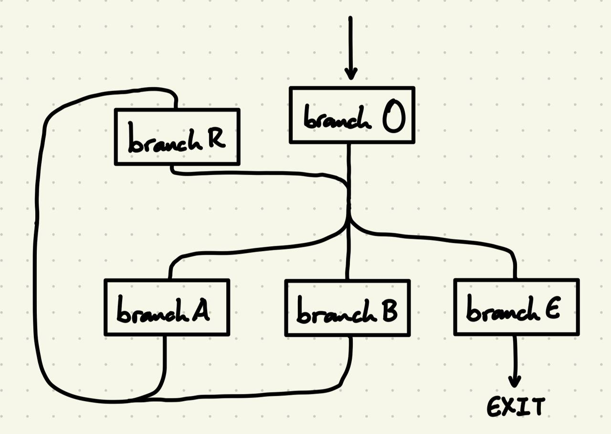
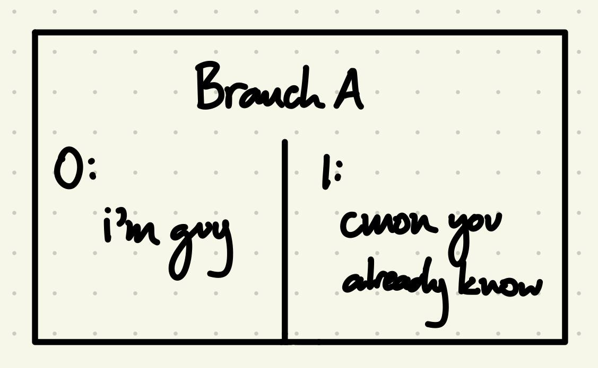

# Overview
Sift's dialogue operates on a branch based system. All dialogue begins at the origin (O) branch, and can enter different branches through direct connections.

In the example above, the player can enter branch A, B, or E through different responses in branch O. Branch A and B bring the player to the re-response (R) branch, where the player can again enter branch A, B, or E. Branch E, the exit branch, with exit the player from dialogue.
# Branches
Each branch is divided into paths, which allows variety in dialogue based on certain conditions. Most often, these conditions will be the number of times the player has gone through the specific branch of dialogue.

In the example above, the player enters branch A by asking the question "Who are you again?" When the player has entered Branch A zero times before, they enter path 0, receiving the response, "i'm guy." When the player has entered Branch A one or more times before, they enter path 1, receiving the reponse, "cmon you already know."

***WORK IN PROGRESS***: Create seperate dialogue paths from conditional statements. e.g. `if number_of_crabs_killed > 10`
# Paths
Each path is an array of dialogue lines. Each line contains the text that will be displayed, and optionally contains reponses that the player can choose or the branch to enter next.